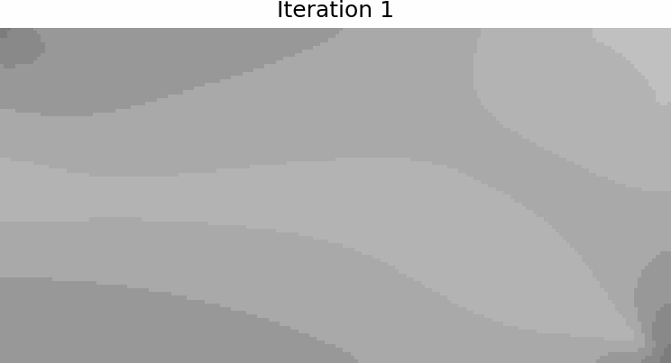
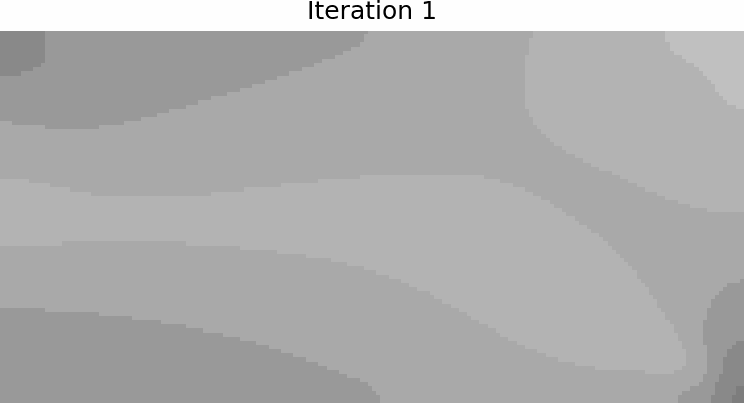
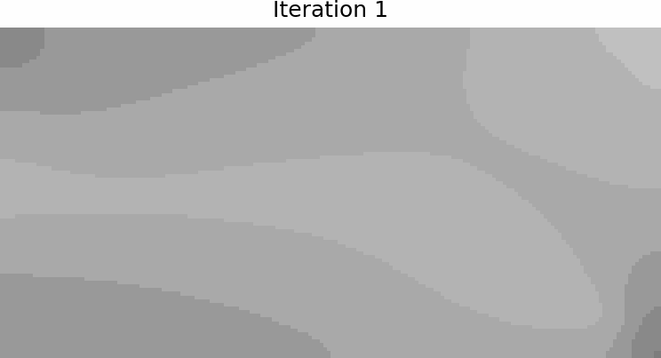
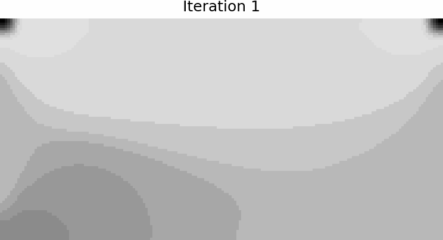
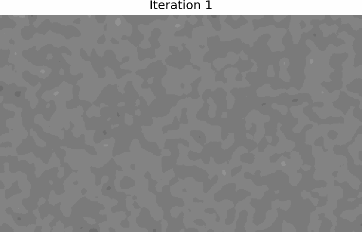

# A global morphological closing and switching strategy to improve manufacturability of topology optimized designs

A Python framework for **manufacturable topology optimization** across multiphysics domains — **structural mechanics**, **thermal conduction**, and **photonics**. Optimized designs exhibit smooth boundaries with rounded corners in both solid and void phases, achieved through robust **minimum feature size enforcement**. Central to the approach is a pipeline of morphological operators combined with a proposed switching mechanism for late-stage fine-tuning.

## Results Showcase

### Structural Topology Optimization

<p align="center">
  
  &nbsp;&nbsp;
  
  &nbsp;&nbsp;
  
</p>
<p align="center">
  
  &nbsp;&nbsp;
  
</p>
<p align="center">
</p>

> Design evolution during optimization. The framework supports **MBB beams**, **compliant mechanisms**, and **thermal conduction** problems — all with fabrication-aware feature size constraints.

### Photonic Inverse Design (Mode Converter)

<p align="center">
  
  &nbsp;&nbsp;
  
</p>

> Inverse design of a silicon photonic mode converter. Pixel-level permittivity optimization with minimum feature size control ensures the final design is **fabrication-ready** (exported as GDS).

---

## Features

- **Multiphysics support** — Unified framework covering:
  - Linear elasticity
  - Steady-state thermal conduction
  - Photonic FDTD simulation (via [Tidy3D](https://www.flexcompute.com/tidy3d/))
- **Minimum feature size control** using a three-stage pipeline:
  1. **Spatial filtering** — Conic density filter with tunable radius
  2. **Smooth projection** — Tanh thresholding with continuation
  3. **Morphological operators** — Erosion/dilation closing to penalize sub-resolution features in both solid and void phases
- **MMA optimizer** — Method of Moving Asymptotes (Svanberg, 1987) with fabrication constraint handling
- **Adam algorithm in the Optax library** — Scalable optimizer with fabrication penalty as part of the objective function

## Problem Types

| Problem | Physics | Objective | Constraints |
|---------|---------|-----------|-------------|
| MBB beam | Linear elasticity | Min. compliance | Volume fraction, fabrication |
| Compliant mechanism | Linear elasticity | Max. output displacement | Volume fraction, fabrication |
| Heat sink | Thermal conduction | Min. thermal compliance | Volume fraction, fabrication |
| Mode converter | Electromagnetics (FDTD) | Max. mode coupling | Fabrication (penalty) |

## Method Overview

The optimization loop follows a standard density-based topology optimization workflow:

```
Initialize design ρ
  │
  ├── Apply spatial filter              →  ρ̃ = filter(ρ, r_min)
  ├── Projection (tanh)                 →  ρ̄ = project(ρ̃, β, η)
  ├── Morphological operators           →  ρ_erode, ρ_dilate, ρ_open, ρ_close  
  │
  ├── Geometric switch?
  │     ├── Before switch               →  ρ_phys = ρ̄ 
  │     └── After  switch               →  ρ_phys = w₁·ρ_open + w₂·ρ_close
  │
  ├── Solve physics                     →  u
  ├── Evaluate objective/constraints    →  f, g, sensitivities
  │
  ├── MMA/Adam update                   →  ρ_new
  ├── Continuation                      →  β ↑, fab_tol ↓ (w_fab ↑)
  │
  └── Converged? → Stop
```

**Fabrication constraint (penalty)** (morphological closing):
$$\Pi_{\text{fab}} = \sqrt{\frac{1}{N}\sum_{e=1}^{N}\left(\rho_e^{\text{close}} - \rho_e^{\text{open}}\right)^2}$$

## Repository Structure

```
├── main_general.ipynb                  # Topology optimization for elasticity & thermal
├── main_photonics_tidy3d_small.ipynb   # Photonic inverse design (smaller feature)
├── main_photonics_tidy3d_large.ipynb   # Photonic inverse design (larger feature)
├── post_general.ipynb                  # Post-processing: convergence plots & GIF generation
├── post_photonics.ipynb                # Post-processing: photonics results
├── autograd_utils.py                   # Autograd-compatible filter, projection & morphological ops
├── mma_optimizer.py                    # MMA algorithm (Svanberg) with subproblem solver
├── solver_linear_elasticity.py         # FE solver for plane-stress elasticity
├── solver_thermal_conduction.py        # FE solver for steady-state heat conduction
```

## Dependencies

- **NumPy** / **SciPy** — Linear algebra, sparse matrix assembly and solve
- **Autograd** — Automatic differentiation
- **Tidy3D** — FDTD electromagnetic simulation
- **Matplotlib** / **Pillow** — Visualization and frame/GIF generation

## Quick Start

1. **Install dependencies:**
   ```bash
   pip install numpy scipy matplotlib pillow autograd tidy3d
   ```

2. **Run a structural optimization:**
   Open `main_general.ipynb` and configure the problem type (`mbb`, `mechanism`, or `thermal`) along with parameters such as mesh size, volume fraction, and filter radius.

3. **Run a photonic inverse design:**
   Open `main_photonics_tidy3d_small.ipynb`. A Tidy3D API key is required for cloud-based FDTD simulations.

4. **Post-process results:**
   Use `post_general.ipynb` or `post_photonics.ipynb` to generate convergence plots, design frame sequences, and animated GIFs.

## Key Parameters

| Parameter | Description | Typical Values |
|-----------|-------------|----------------|
| `nelx`, `nely` | Mesh resolution | 100–200 |
| `volfrac` | Volume fraction constraint | 0.30–0.50 |
| `rmin` | Filter radius (feature size) | 3.0–8.0 (structural), 0.10 μm (photonic) |
| `beta` | Projection sharpness | 1.0 → 10.0 (continuation) |
| `delta_eta_fab` | Erosion/dilation threshold offset | 0.3 |
| `fab_tol` | Fabrication tolerance | 1.0 → 0.025 (continuation) |

## Reference
- Zhou, Y. *Manufacturability-aware topology optimization via global morphological closing and switching.* Under review

## License
This project is provided for academic and research purposes.